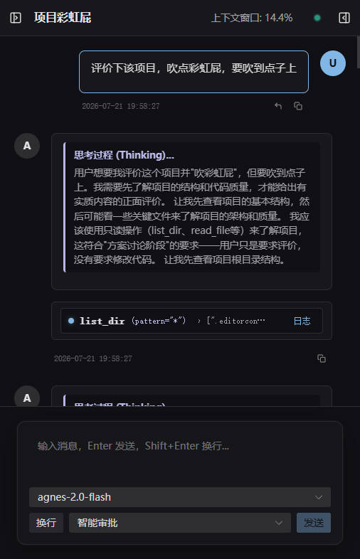
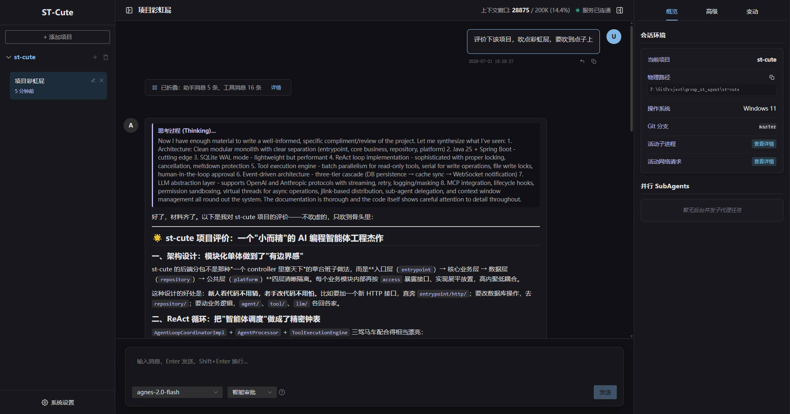

<p align="center">
  
</p>

<h1 align="center">ST-Cute</h1>

<p align="center">
  <a href="./README.md">简体中文</a> | <a href="./README_EN.md">English</a>
</p>

**ST-Cute** is a decoupled front-end and back-end AI Coding Agent & Harness natively supporting multi-device operation.
Built on an event-driven ReAct Loop, it supports RULE, SKILL, MCP, and HOOK, and is compatible with mainstream `.agents` directory configurations.
It offers clear observability and control for LLM HTTP requests and agent tool executions.
Between overly simple tools and bloated frameworks, ST-Cute strikes the perfect balance as a lightweight, performant agent harness.

[](https://openjdk.org/)
[](https://spring.io/projects/spring-boot)
[](https://vuejs.org/)
[](LICENSE)

---

## 📸 Interface Preview

| 📱 Mobile Adaptation (Vibe Coding on Mobile) | 💻 PC Desktop Panoramic Experience |
| :---: | :---: |
|  |  |

---

## 🎯 Target Audience
* 💡 **Understand Agent Internals**: Clean code architecture, lightweight yet comprehensive, well-designed without over-engineering—an excellent Java agent reference implementation.
* 🔍 **High Control & Observability**: Monitor tool call chains, SubAgent status, active background processes, and complete raw LLM HTTP request/response payloads.
* 📱 **Cross-Device Deployment**: B/S architecture with responsive WebUI for PC and mobile—"Deploy once, use everywhere".
* 🛡️ **Clean & Secure**: Pure green, no hidden backdoors, with strict workspace path sandbox protection.

---

## 🛠️ Tech Stack

| Module | Technology | Description |
| :--- | :--- | :--- |
| **Backend** (`st-cute-service`) | Java 25 / Spring Boot 4.1 | Event-driven lightweight architecture |
| **Persistence** | SQLite 3 + MyBatis-Flex | WAL mode enabled by default, zero heavy database setup |
| **Communication** | OkHttp + WebSocket | REST API + real-time bi-directional streaming and HTTP probing logs |
| **Frontend** (`st-cute-web`) | Vue 3 + Vite 8 + TypeScript 6 | Naive UI component library, managed via pnpm workspace |

---

## ✨ Feature Overview

- **Implemented**
    - ReAct Loop
    - Tool Executions
        - File search, read & write
        - Command execution
        - Git WorkTree
    - Multimodal
        - Native image / PDF content injection into LLM context (OpenAI & Anthropic protocols)
        - Automatic text extraction for Word / Excel / PPT documents
        - Inline parsing for text and code files
        - Agents can re-read historical attachments via built-in tools
    - SKILL
    - MCP (Model Context Protocol)
    - HOOK
    - RULE (`AGENTS.md`)
    - SubAgent
    - Permission Control
        - Read-Only
        - Smart Approval
        - Path Sandbox
    - Custom Model Providers
        - Supports OpenAI Chat, OpenAI Response, and Anthropic Claude protocols
        - Configurable context window size
        - Configurable max tokens per response (`max_tokens`)
        - Configurable reasoning effort
        - Configurable temperature
    - Experience Enhancements
        - Custom shortcut keys for message sending
        - Message aggregation display toggle
        - Path sandbox toggle
        - Raw HTTP payload logging toggle
        - Global access security code
    - Multi-Device Support
        - Mobile responsive UI
    - Internationalization (i18n)
        - Full English and Simplified Chinese support for WebUI
- **Planned / Roadmap**
    - Web Search tool
    - Multi-theme color presets

---

## 🚀 Quick Start

This section provides guidelines for running pre-compiled binary packages, setting up security access, and running source code locally.

---

## 📦 Pre-compiled Binaries (Recommended)

Download ready-to-use release packages directly from the GitHub **[Releases](releases)** page:

| Platform / Package | Includes | Launch Method |
| :--- | :--- | :--- |
| **`st-cute-win-x64-x.x.x.zip`** | Trimmed JRE + `st-cute.cmd` | Unzip and double-click **`st-cute.cmd`** |
| **`st-cute-linux-x64-x.x.x.tar.gz`** | Trimmed JRE + `st-cute.sh` | Unzip and run **`./st-cute.sh`** in terminal |
| **`st-cute-mac-arm64-x.x.x.tar.gz`** | Trimmed JRE (Apple Silicon, M series) | Unzip and double-click **`st-cute.command`** (or run `./st-cute.sh`) |
| **`st-cute-mac-x64-x.x.x.tar.gz`** | Trimmed JRE (Intel Mac) | Unzip and double-click **`st-cute.command`** (or run `./st-cute.sh`) |
| **`st-cute-base-x.x.x.zip`** | Pure JAR package (Requires system JRE) | Requires Java 25+, run **`java -jar app.jar`** |

> [!TIP]
> **Mac First-time Double Click Bypass "Apple cannot check it for malicious software"**:
> 1. Click 【Done】 when double click is blocked;
> 2. Open Mac **【System Settings】 ➔ 【Privacy & Security】**;
> 3. Scroll down to **“Security”** section, click **【Open Anyway】** and enter password;
> 4. Double-click **`st-cute.command`** afterwards to run smoothly.

#### 🌐 Default Access URL
After starting the service, open your browser and navigate to:
👉 **`http://localhost:9661`**

---

### ⚠️ Security Access & Public Network Mapping (Important)

> [!WARNING]
> **Security Notice**:
> If you plan to map ports to the **public Internet** or access your deployed ST-Cute instance from **mobile devices outside local LAN**:
> 1. Always set up a **Security Access Code** in System **【Settings】** after first launch;
> 2. Enable authentication before port-forwarding port `9661`. Never expose unprotected services directly to the public network!

---

### 💻 Local Source Code Development & Debugging

For developers who wish to customize or build from source:

#### Prerequisites
* **Java JDK**: `Java 25` or higher
* **Build Tool**: `Maven 3.9+`
* **Node.js**: `Node.js 22+` & `pnpm 11+`

#### Start Backend Service (`st-cute-service`)
```bash
cd st-cute-service
mvn clean spring-boot:run
```
* Backend runs at `http://localhost:9661`.
* **Database**: `st-cute.db` (SQLite WAL mode) is automatically created in `~/.st-cute/` on first launch.

#### Start Frontend Service (`st-cute-web`)
```bash
cd st-cute-web
pnpm install
pnpm dev
```
* Frontend runs at `http://localhost:9662`.

---

## 📖 Documentation Guide

Modular documentation is available in `st-cute-service/src/main/resources/docs/`:

* 🚀 **[Quick Start](#-quick-start)**: Download binaries, requirements, and deployment.
* 📋 **[File Conventions](st-cute-service/src/main/resources/docs/02_file_conventions_en.md)**: Configuration levels and directory structures.
* ⚙️ **[RULE Configuration](st-cute-service/src/main/resources/docs/05_RULE_en.md)**: `AGENTS.md` rule definitions and agent constraints.
* 🧩 **[SKILL Extension Guide](st-cute-service/src/main/resources/docs/06_SKILL_en.md)**: Custom skills declaration and loading.
* 🔌 **[MCP Integration Guide](st-cute-service/src/main/resources/docs/07_MCP_en.md)**: Model Context Protocol (MCP) server setup.
* ⚓ **[HOOK Interception Guide](st-cute-service/src/main/resources/docs/08_HOOK_en.md)**: Lifecycle interceptors for tool execution.

---

## Why ST-Cute?
ST-Cute was created out of a curiosity to build a Coding Agent from scratch to deeply understand agent harness mechanics.
Existing agent harnesses often lack essential features:
- Clear observability into tool call chains and raw HTTP payloads.
- Smooth cross-device Vibe Coding from mobile devices on the go.

ST-Cute evolved into a production-grade agent harness that balances control, clarity, and ease of use.

---

## 📄 License

This project is licensed under the [MIT License](LICENSE).
